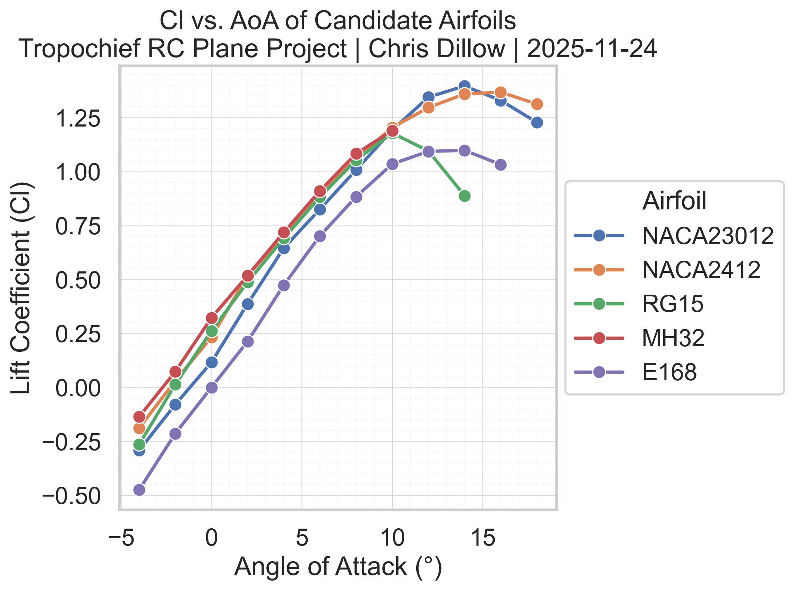
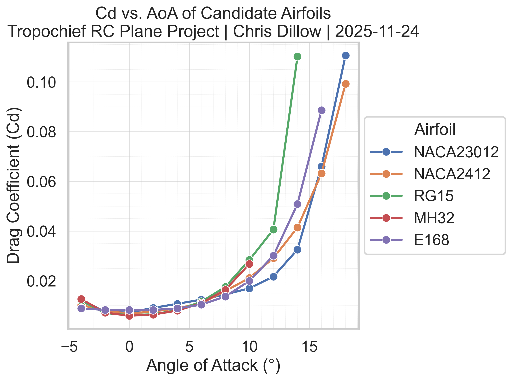
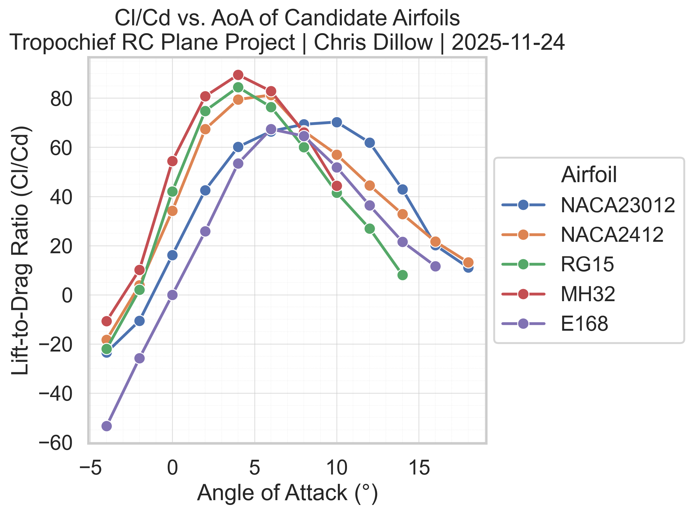
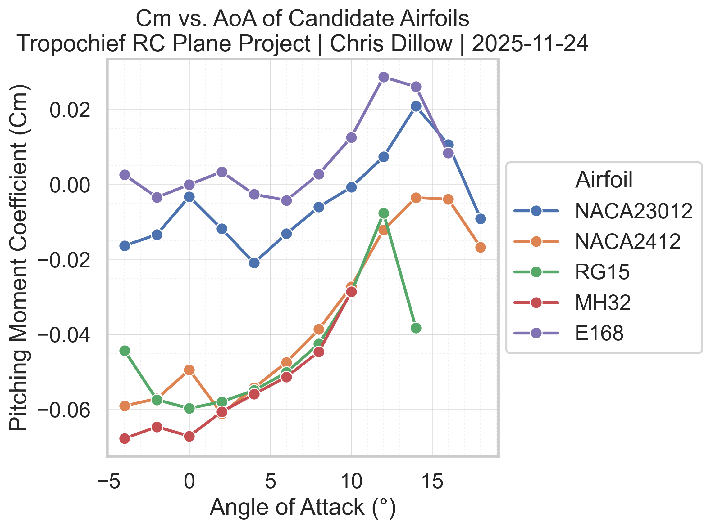

# Airfoil Selection Study
#### Screening Completion Date: November 24, 2025
- This document is auto-updated by [`airfoil_screening.py`](https://github.com/chrisdillow/Tropochief-RC-Plane/blob/main/analysis/airfoil_screening/airfoil_screening.py)
- Figures are generated in [`analysis/airfoil_screening/figures/`](https://github.com/chrisdillow/Tropochief-RC-Plane/tree/main/analysis/airfoil_screening/figures)

## 1. Cl vs AoA


## 2. Cd vs AoA


## 3. Cl/Cd vs AoA


## 4. Cm vs AoA


## 5. Numerical Summary

```text
            maxCl   minCd  maxClCd  maxClCd_cruiseBand
airfoil                                               
NACA23012  1.3968  0.0072  70.2711             66.4895
NACA2412   1.3680  0.0068  81.2534             81.2534
RG15       1.1789  0.0062  84.4689             84.4689
MH32       1.1901  0.0059  89.4894             89.4894
E168       1.0982  0.0082  67.3896             67.3896
```

## 6. Lift-Curve Slopes

```text
           liftCurveSlope  alphaLinearMin  alphaLinearMax  linearFitR2
airfoil                                                               
NACA23012          0.1048            -4.0            12.0       0.9943
NACA2412           0.0893            -4.0            14.0       0.9744
RG15               0.1093            -4.0             8.0       0.9933
MH32               0.1023            -4.0             8.0       0.9974
E168               0.1023            -4.0            12.0       0.9849
```

## 7. Multi-Objective Rankings

Top candidates by objective:

- Forward-swept / stability-oriented (Score A): E168, NACA2412
- Efficiency, cruise-focused (Score B): MH32, RG15
- Maneuverability vs torsion (Score C): RG15, NACA23012

### 7.1 Score A – Forward-Swept / Stability-Oriented

```text
           scoreStability
airfoil                  
E168                0.849
NACA2412            0.800
NACA23012           0.613
RG15                0.034
MH32                  NaN
```

### 7.2 Score B – Efficiency

```text
           scoreEfficiency
airfoil                   
MH32                 1.000
RG15                 0.810
NACA2412             0.638
NACA23012            0.134
E168                 0.027
```

### 7.3 Score C – Maneuverability vs Torsion

```text
           scoreManeuverTorsion
airfoil                        
RG15                      0.636
NACA23012                 0.611
MH32                      0.570
E168                      0.560
NACA2412                  0.485
```
